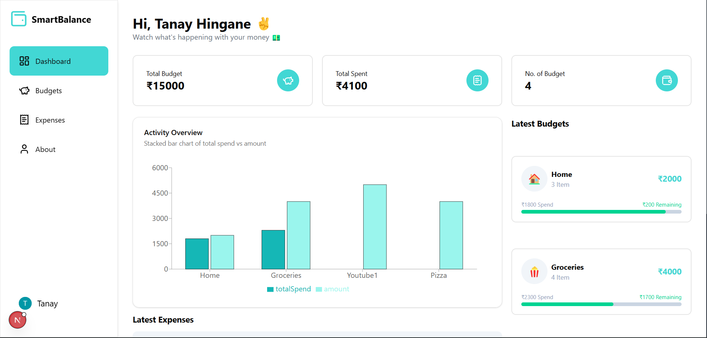

# SmartBalance

**SmartBalance** is a full-stack web application that provides users with personalized financial dashboards using modern web technologies like Next.js, Clerk for authentication, and Drizzle ORM with Neon for serverless PostgreSQL integration.



## 🌟 Features

- 🔐 User Authentication via [Clerk](https://clerk.dev)
- 📊 Interactive Dashboard with bar charts and data cards
- ⚡ Serverless Database via [Neon](https://neon.tech) & [Drizzle ORM](https://orm.drizzle.team)
- 🎨 Beautiful UI using Radix UI and Tabler Icons
- 🌐 Built with Next.js 13+ App Router

## 🧱 Tech Stack

- **Frontend**: React, Next.js 13 App Router, TypeScript
- **UI**: Radix UI, Tabler Icons, Tailwind CSS
- **Backend**: Neon (PostgreSQL), Drizzle ORM
- **Auth**: Clerk
- **Deployment**: Vercel (suggested)

## 📂 Project Structure

```
SmartBalance
├── app/
│   ├── (auth)/           # Sign-in / Sign-up routes
│   ├── (routes)/         # Dashboard components and routes
│   └── page.tsx          # Main landing page
├── drizzle.config.js     # Drizzle ORM configuration
├── middleware.ts         # Clerk Middleware
├── package.json          # Project metadata and dependencies
├── tsconfig.json         # TypeScript config
```

## 🚀 Getting Started

### 1. Clone the Repository

```bash
git clone https://github.com/TanayHingane/SmartBalance.git
cd SmartBalance
```

### 2. Install Dependencies

```bash
npm install
```

### 3. Configure Environment Variables

Create a `.env.local` file and add necessary keys (e.g., for Clerk, NeonDB, etc.):

```bash
CLERK_SECRET_KEY=your_key
DATABASE_URL=your_neon_db_url
```

### 4. Run the Development Server

```bash
npm run dev
```

Open [http://localhost:3000](http://localhost:3000) to view the app.

### 5. Push Database Schema (Drizzle ORM)

```bash
npm run db:push
```

## 📦 Available Scripts

- `npm run dev` - Start dev server
- `npm run build` - Build for production
- `npm run start` - Start production server
- `npm run lint` - Lint source code
- `npm run db:push` - Push DB schema using Drizzle ORM

## 🛠 Dependencies Highlight

- `@clerk/nextjs` – Authentication provider
- `@neondatabase/serverless` – Serverless PostgreSQL
- `drizzle-orm` – Type-safe SQL ORM
- `@radix-ui/*` – Headless UI components
- `tailwindcss` – Utility-first CSS framework

## 🤝 Contributing

Contributions are welcome! Feel free to open issues or submit pull requests.

## 📄 License

This project is licensed under the MIT License.
